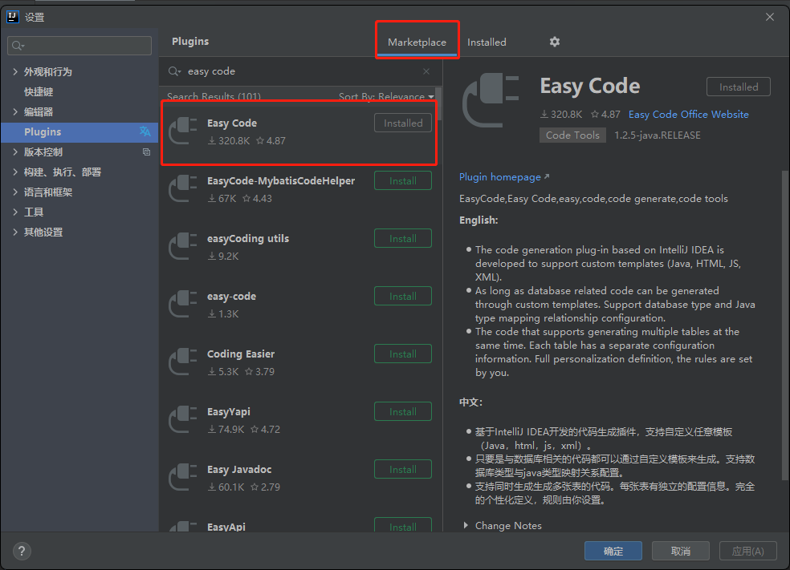
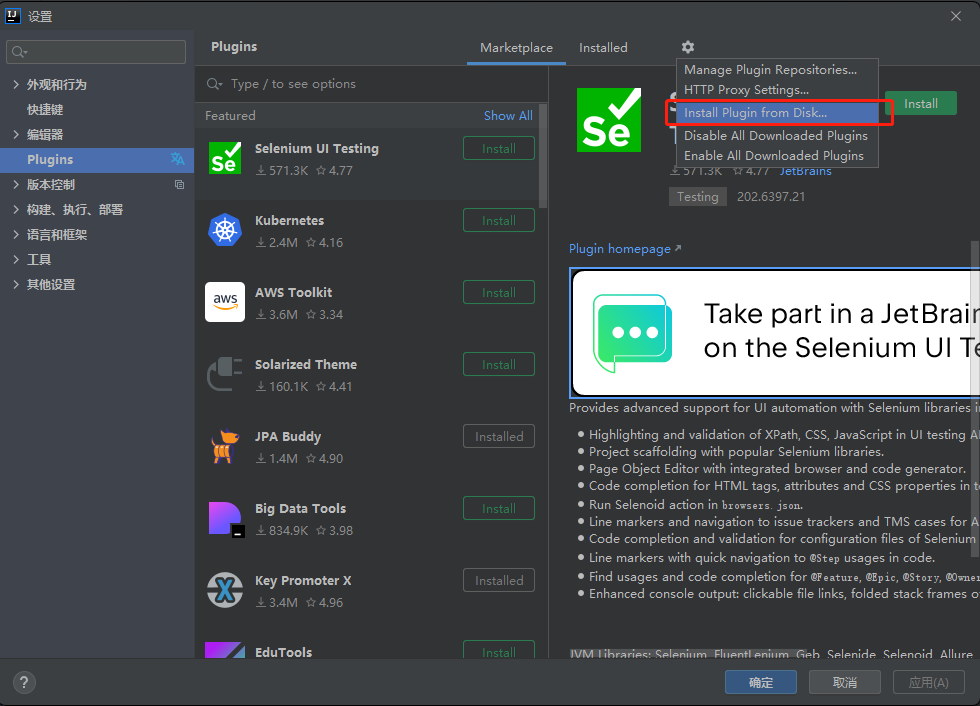
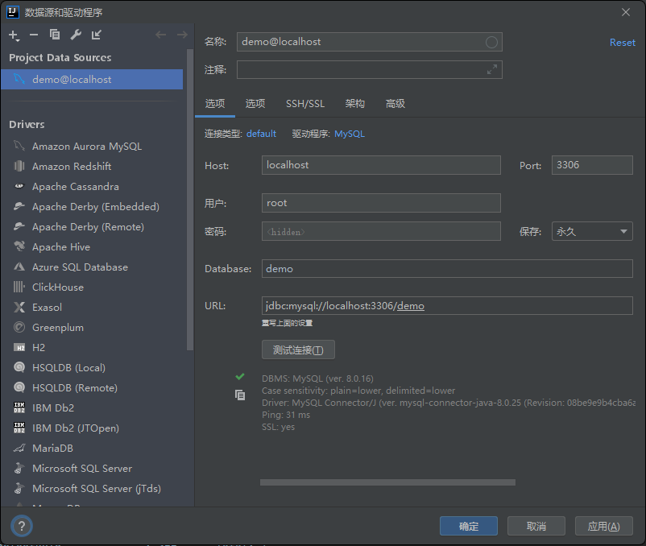
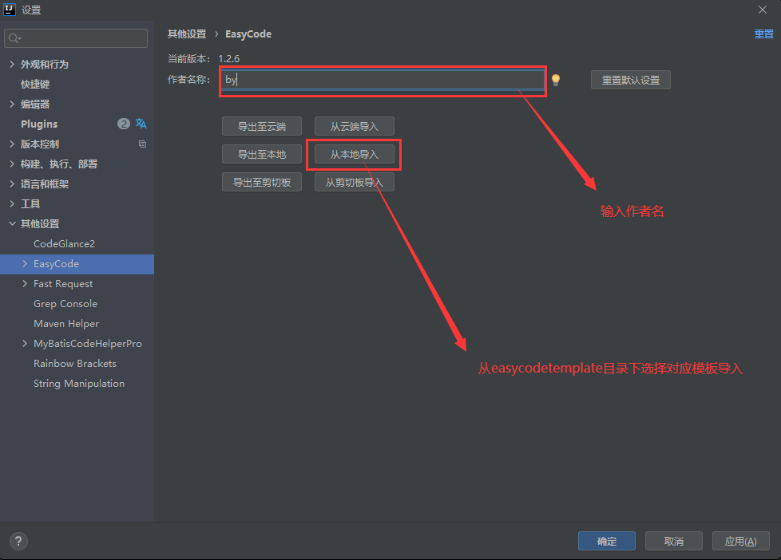
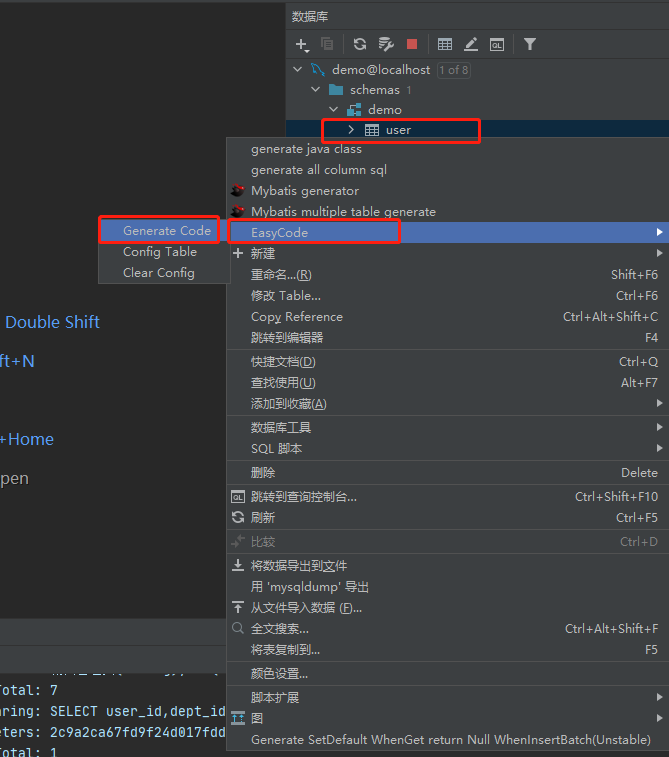
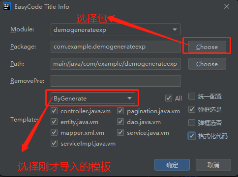
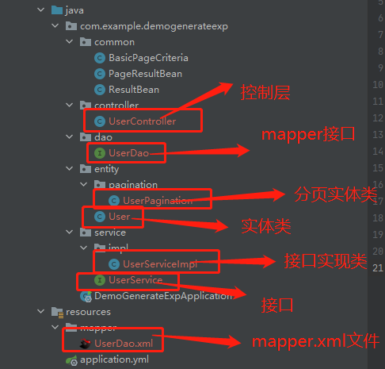

# base_project

脚手架项目

用idea的eazycode插件实现curd自动生成

### 项目结构
```
项目结构
├─base_project（项目根）
│  ├─easycodetemplate（包含easycode各个版本的模板文件）
│  ├─src src目录
│  │  ├─java java 目录
│  │  │  ├─com.example.scengine 根路径
│  │  │  │  ├─common 项目公共目录
│  │  │  │  │  ├─modelconfig 模型层配置目录（包括mybatis-plus防全全表更新，插入修改前拦截等配置）
│  │  │  │  │  │  ├─MybatisPlusConfig 防全表更新与删除配置
│  │  │  │  │  │  ├─MyMetaObjectHandler 插入修改前拦截配置自动生成createTime
│  │  │  │  │  ├─utils 项目工具目录（待各位大佬更新）
│  │  │  │  │  │  ├─HttpRequestUtil HTTP请求工具类
│  │  │  │  │  │  ├─RsaUtil RSA加密工具类
│  │  │  │  │  │  ├─JsonUtil Json工具类
│  │  │  │  │  ├─validconfig 检验插件配置目录
│  │  │  │  │  │  ├─Insert 校验添加数据分组接口
│  │  │  │  │  │  ├─Update 校验修改数据分组接口
│  │  │  │  │  ├─BadRequestExceptionHandler 错误请求异常拦截类（目前拦截了校验错误拦截处理和参数类型转换错误）
│  │  │  │  │  ├─BasicPageCriteria 分页基础类，包含排序和分页属性
│  │  │  │  │  ├─PageResultBean 分页结果集封装类
│  │  │  │  │  ├─ResultBean 普通结果集封装类
│  │  │  │  ├─BaseProjectApplication 项目启动类
│  │  ├─resources 项目资源目录
│  │  │  ├─application.yml 项目整体配置类
```
### 使用方法
#### 1.安装eazycode
可选联网安装或者本地安装
(1)联网安装
File | Settings | Plugins

(2)本地安装
找到根目录下的EasyCode-1.2.5-java.RELEASE.zip文件

#### 2.连接数据库

#### 3.导入模板
File | Settings | 其他设置 | EasyCode

#### 4.生成代码



#### 5.测试
(1)修改application.yml文件的连库信息实体类扫描路径等信息

(2)启动项目并用postman等工具测试

#### 问题说明
目前支持有主键的表<br>
由于用了Lombok，如果idea未装插件可能导致爆红

#### 备注
在impl实现类里可以调用mybatis-plus的方法具体见官方文档
https://baomidou.com/

#### 更新日志
V1.1<br>
1.增加了create_time字段自动插入当前时间功能，使用此模板需要在项目中添加com/example/demogenerateexp/common/MyMetaObjectHandler.java文件<br>
2.分页方法增加了根据create_time倒序排列的功能

V1.2<br>
1.模板支持数据库类型为int bigint类型的主键<br>
2.接口返回格式改成ResultBean下的默认格式

V1.3<br>
1.实体类增加了@NotBlank，@Length注解的自动生成，并实现了添加修改分组校验功能<br>
2.控制层增加了@Validated注解，添加校验拦截器<br>
3.控制层@RequestMapping注解路径修改，便于快速查找接口